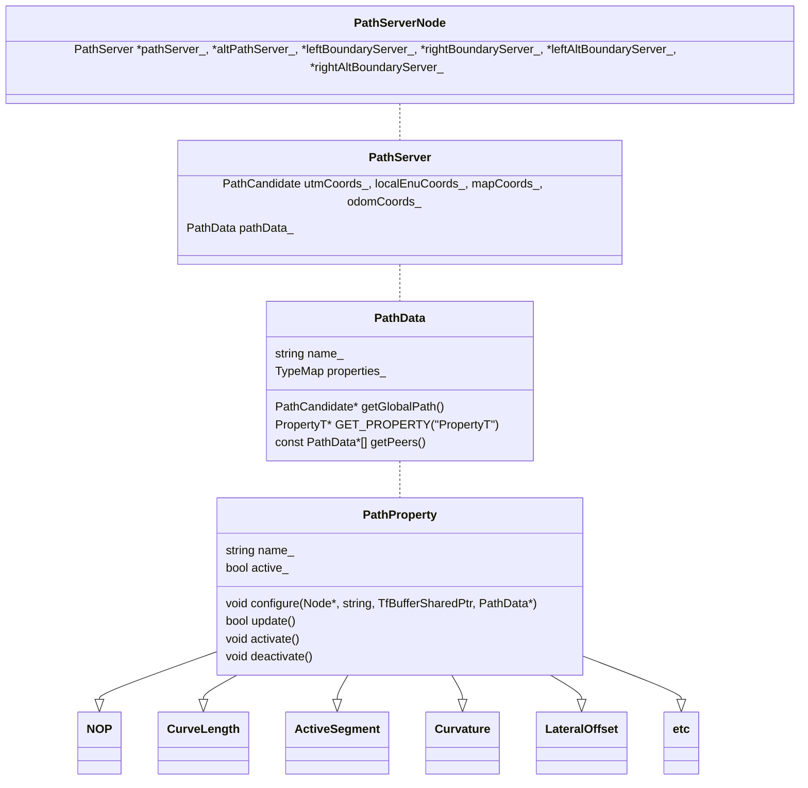

# A frenet frame path server for modularized tightly-coupled properties

The package provides the infrastructural piping of handling path planning and path segments that is closest to the robot. This package is meant to serve as the "move_base" package of path planning but in Frenet frame. The formulation of Frenet frame simplifies the path planning problem in narrow (elongated) spaces, compared to the 2-D costmap method, by projecting the decision space onto a one-dimensional space. Multiple base paths are registered to the ROS node, and the user can cluster the paths based on contextual associations. The path server package adopts a common plugin interface, where properties are associated with 1-D path segments on each registered path. The registered path properties of a path can index each other and access their publicised methods, enabling efficient calculation of tightly-coupled properties. The properties of a cluster of contextually-associated paths are updated in a interleaving pattern.

The important class members are illustrated in this figure:


The path server node instantiates six path server instances, responsible for initial path with boundaries, and the standby (alternative) path with boundaries. Each instance uses a path coordinate `csv` file to initialize. The path coordinate along with its reference frame are stored in the path server instance, under one of the path candidates. As time progresses, the path server instance checks the TF tree, and propagates the information to other transformable frames as a fault-tolerant backup. This happens at 1s interval. Eventually, all path candidates that are transformable to the initialization reference frame will be synced with the latest path coordinates.

The six path server instances are clustered into two groups, based on whether they are currently active or standing by. A cluster is a `PeerHandle` class, which coordinates the update of each path server instance within that cluster. Here, the center line is set as the `leader` of the cluster, and the boundaries are the `followers`. The boundaries are re-sampled at startup to synchronize with the center line (by setting the cluster as `bonds` instead of `peers`). The path server node checks whether the main path and the standby path can be swapped, by calling the `swapActivePathPrecond` method. If this method returns true, the two path clusters are swapped.

The path server instance achieves run-time fault mitigation by pointing to *one of* the path candidates that is transformable to `base_link`. This pointer is returned by the `getGlobalPath()` method. If multiple frames are transformable, they follow a precedence of `utm > local_enu > map > odom`. Based on the pointer to the transformable global path, the `PathData` instance within the path server is updated. The update happens in two parts. In the first part, all leader path server instances within a cluster will update the index to the nearest point on its path (if the cluster is set up in `peers` mode, every instance will be their own leaders). The follower instances will skip this step as they synchronize this index with the leader. In the second part, all instances will update their property plugins in an interleaving pattern and following descreasing order of priority. Specifically, a leader has the highest priority within that cluster. For example, instances `leader`, `follower1`, `follower2` are within the same cluster, having priorities 2, 1, 0, and each has 3, 2, 4 registered property plugins. The updating sequence will be:
```
leader.property[0], follower1.property[0], follower2.property[0],
leader.property[1], follower1.property[1], follower2.property[1],
leader.property[2],                        follower2.property[2],
                                           follower2.property[3].
```
Please consider the inter-plugin dependency when writing the launch configuration. If a plugin of an instance is has misaligned dependency with its update order, insert the `NOP` (no-operation) plugin in the plugin list for manual alignment. For the example above, if `follower2.property[1]` relies on the latest update of `leader.property[2]`, we can insert a `NOP` plugin in the second place of its plugin list.
